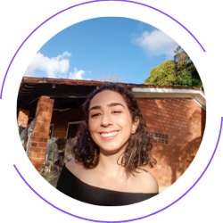

# projeto-final-powerbi

# Accenture - Gama Academy - Mulheres em Tech - Data Engineer/Azure - Versão em Spark

Este é o repositório da versão do projeto em Spark.

Para retornar ao repositório geral, clique [aqui](https://github.com/SheAnalyzes/readme-repository)!

## Índice

- [Apresentação do problema](#apresentação-do-problema)
- [Tecnologias utilizadas](#tecnologias-utilizadas)
- [Estrutura do projeto](#estrutura-do-projeto)
- [Instalando as bibliotecas](#instalando-as-bibliotecas)
- [Criação das funções que fazem a leitura do csv](#criação-das-funções-que-fazem-a-leitura-do-csv)
- [Criação da lógica de identificação das fraudes](#criação-da-lógica-de-identificação-de-fraudes)
- [Criação dos dataframes com a identificação das fraudes](#criação-dos-dataframes-com-a-identificação-das-fraudes)
- [Criação conexão com banco de dados](#criação-conexão-com-banco-de-dados)
- [Salvar os dados no banco de dados](#salvar-os-dados-no-banco-de-dados)
- [Instalação](#instalação)
- [Grupo - SheAnalyses](#grupo---sheanalyses)

## Apresentação do problema

Desenvolver uma aplicação em Python para carga de arquivos em um banco de dados SQL e gerar relatórios estatísticos visando a descoberta de fraudes em conta correntede cartão de crédito.

Você pode encontrar o link do desafio [aqui](https://docs.google.com/document/d/10fBZm7Sxm60FEIyNk4rqUE-pJLhXRxDi1grAATF7hVw/edit)!

## Tecnologias utilizadas nesta etapa do Projeto

* Power BI;
* Power Query;
* DAX.

## Estrutura do projeto

```
├── README.md
├── pbi_projeto_final.pbix

```

## Download necessário

[Instalação do Software Microsoft Power BI](https://www.microsoft.com/en-us/download/details.aspx?id=58494)! 
O relatório foi desenvolvido na versão: 2.114.864.0 

## Conexão com o banco de dados
Para uso do Power Query é necessária a conexão do Power BI com o banco de dados e liberações de Firewall.
Servidor: projetosfinalserver.database.windows.net
Porta: 1433


<p>Tratamento de Dados com DAX</p>
<table>
  <colgroup>
    <col class="column1">
    <col class="columns2plus3" span="2">
  </colgroup>
  <tr>
    <th>Nome Medida</th>
    <th>Códigos</th>
    <th>Definição</th>
  </tr>
  <tr>
    <td>Clientes_cadastrados
</td>
    <td>DISTINCTCOUNT(clientes[id])</td>
    <td>Contagem de clientes distintos cadastrados na tabela cliente</td>
  </tr>
   <tr>
    <td>Clientes_fraudes_in </td>
    <td>CALCULATE(DISTINCTCOUNT(clientes_fraudes[Id_nome_cliente]), clientes_fraudes[n_fraudes_entrada] >0 && clientes_fraudes[n_fraudes_saida] = 0)

</td>
    <td>Contagem de clientes distintos cujas fraudes detectadas envolveram exclusivamente transações de entrada. e</td>
  </tr>
   <tr>
    <td>Clientes_fraudes_out </td>
    <td>CALCULATE(DISTINCTCOUNT(clientes_fraudes[Id_nome_cliente]), clientes_fraudes[n_fraudes_entrada] = 0 && clientes_fraudes[n_fraudes_saida] > 0)
</td>
    <td>Contagem de clientes distintos cujas fraudes detectadas envolveram exclusivamente transações de saída. 

</td>
  </tr>
</table>


## Grupo - SheAnalyses


| Ana Paula Santos de Queiroz<br /><br />Linkedin: [/ana-paula-santos-de-queiroz-086807166](https://www.linkedin.com/in/ana-paula-santos-de-queiroz-086807166/)<br />Github: [/Queirozaps](https://github.com/Queirozaps) |  |
| :---------------------------------------------------------------------------------------------------------------------------------------------------------------------------------------------------------------: | :--------------------------------------------: |
|  **Arianna Silveira Santos**<br />  <br />Linkedin: [/arianna-silveira-aa474514b](https://www.linkedin.com/in/arianna-silveira-aa474514b/)<br />Github: [/AriannaSilveira](https://github.com/AriannaSilveira)  |  |
|                            **Carolina Gois**<br /><br />Linkedin: [/carolina-gois](https://www.linkedin.com/in/carolina-gois/)<br />Github: [/carolgois](https://github.com/carolgois)                            |  |
|                   **Emilly Correa Santiago**<br /><br />Linkedin: [/emillysantiago23](https://www.linkedin.com/in/emillysantiago23/)<br />Github: [/emillysant](https://github.com/emillysant)                   |  |
|                              **Mariana Freire**<br /><br />Linkedin: [/maricf](https://www.linkedin.com/in/maricf/)<br />Github: [/marianafreire](https://github.com/marianafreire)                              |  |
|             **Priscila Assumpção Fernandes**<br /><br />Linkedin: [/priscila-af](https://www.linkedin.com/in/priscila-af/)<br />Github: [/priscilaassumpcao](https://github.com/priscilaassumpcao)             |  |
|                    **Vivian Medina**<br /><br />Linkedin: [/vivian-medina-b7250961](https://www.linkedin.com/in/vivian-medina-b7250961/)<br />Github: [/medinavi](https://github.com/medinavi)                    |  |
